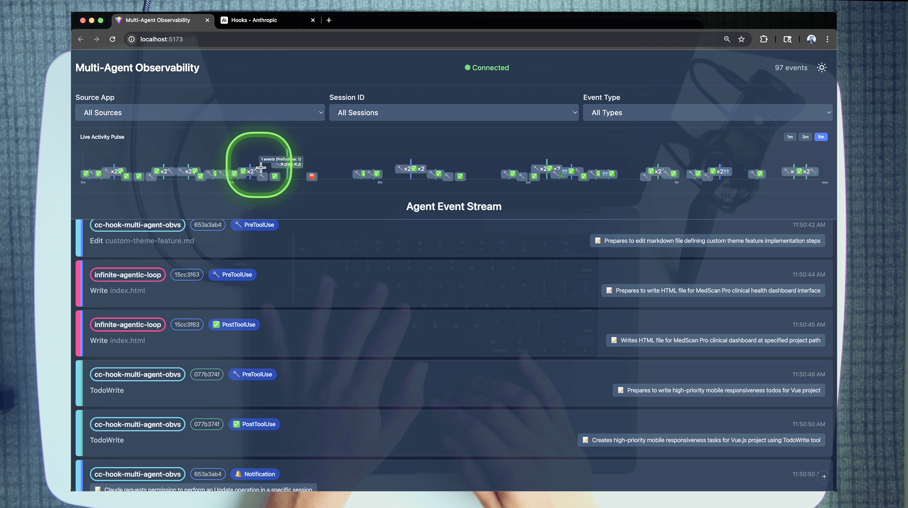
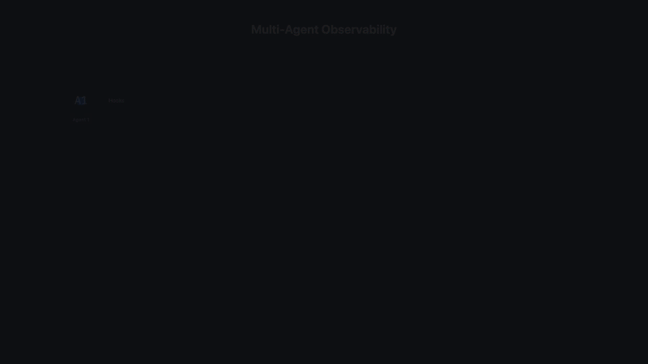

# Multi-Agent Observability System

Real-time monitoring and visualization for Claude Code agents through comprehensive hook event tracking. You can watch the [full breakdown here](https://youtu.be/9ijnN985O_c).

## 🎯 Overview

This system provides complete observability into Claude Code agent behavior by capturing, storing, and visualizing Claude Code [Hook events](https://docs.anthropic.com/en/docs/claude-code/hooks) in real-time. It enables monitoring of multiple concurrent agents with session tracking, event filtering, and live updates. 



## 🏗️ Architecture

```
Claude Agents → Hook Scripts → HTTP POST → Bun Server → SQLite → WebSocket → Vue Client
```



## 📋 Setup Requirements

Before getting started, ensure you have the following installed:

- **[Claude Code](https://docs.anthropic.com/en/docs/claude-code)** - Anthropic's official CLI for Claude
- **[Astral uv](https://docs.astral.sh/uv/)** - Fast Python package manager (required for hook scripts)
- **[Bun](https://bun.sh/)**, **npm**, or **yarn** - For running the server and client
- **Anthropic API Key** - Set as `ANTHROPIC_API_KEY` environment variable
- **OpenAI API Key** (optional) - For multi-model support with just-prompt MCP tool
- **ElevenLabs API Key** (optional) - For audio features

### Configure .claude Directory

To setup observability in your repo,we need to copy the .claude directory to your project root.

To integrate the observability hooks into your projects:

1. **Copy the entire `.claude` directory to your project root:**
   ```bash
   cp -R .claude /path/to/your/project/
   ```

2. **Update the `settings.json` configuration:**
   
   Open `.claude/settings.json` in your project and modify the `source-app` parameter to identify your project:
   
   ```json
   {
     "hooks": {
       "PreToolUse": [{
         "matcher": ".*",
         "hooks": [
           {
             "type": "command",
             "command": "uv run .claude/hooks/pre_tool_use.py"
           },
           {
             "type": "command",
             "command": "uv run .claude/hooks/send_event.py --source-app YOUR_PROJECT_NAME --event-type PreToolUse"
           }
         ]
       }],
       // ... (mirror the above for other event types)
     }
   }
   ```
   
   Replace `YOUR_PROJECT_NAME` with a unique identifier for your project (e.g., `my-api-server`, `react-app`, etc.).

3. **Ensure the observability server is running:**
   ```bash
   # From the observability project directory (this codebase)
   ./scripts/start-system.sh
   ```

Now your project will send events to the observability system whenever Claude Code performs actions.

## 🚀 Quick Start

You can quickly view how this works by running this repositories .claude setup.

```bash
# 1. Start both server and client
./scripts/start-system.sh

# 2. Open http://localhost:5173 in your browser

# 3. Open Claude Code and run the following command:
Run git ls-files to understand the codebase.

# 4. Watch events stream in the client

# 5. Copy the .claude folder to other projects you want to emit events from.
cp -R .claude <directory of your codebase you want to emit events from>
```

## 📁 Project Structure

```
claude-code-hooks-multi-agent-observability/
│
├── apps/                    # Application components
│   ├── server/             # Bun TypeScript server
│   │   ├── src/
│   │   │   ├── index.ts    # Main server with HTTP/WebSocket endpoints
│   │   │   ├── db.ts       # SQLite database management & migrations
│   │   │   └── types.ts    # TypeScript interfaces
│   │   ├── package.json
│   │   └── events.db       # SQLite database (gitignored)
│   │
│   └── client/             # Vue 3 TypeScript client
│       ├── src/
│       │   ├── App.vue     # Main app with theme & WebSocket management
│       │   ├── components/
│       │   │   ├── EventTimeline.vue      # Event list with auto-scroll
│       │   │   ├── EventRow.vue           # Individual event display
│       │   │   ├── FilterPanel.vue        # Multi-select filters
│       │   │   ├── ChatTranscriptModal.vue # Chat history viewer
│       │   │   ├── StickScrollButton.vue  # Scroll control
│       │   │   └── LivePulseChart.vue     # Real-time activity chart
│       │   ├── composables/
│       │   │   ├── useWebSocket.ts        # WebSocket connection logic
│       │   │   ├── useEventColors.ts      # Color assignment system
│       │   │   ├── useChartData.ts        # Chart data aggregation
│       │   │   └── useEventEmojis.ts      # Event type emoji mapping
│       │   ├── utils/
│       │   │   └── chartRenderer.ts       # Canvas chart rendering
│       │   └── types.ts    # TypeScript interfaces
│       ├── .env.sample     # Environment configuration template
│       └── package.json
│
├── .claude/                # Claude Code integration
│   ├── hooks/             # Hook scripts (Python with uv)
│   │   ├── send_event.py  # Universal event sender
│   │   ├── pre_tool_use.py    # Tool validation & blocking
│   │   ├── post_tool_use.py   # Result logging
│   │   ├── notification.py    # User interaction events
│   │   ├── stop.py           # Session completion
│   │   └── subagent_stop.py  # Subagent completion
│   │
│   └── settings.json      # Hook configuration
│
├── scripts/               # Utility scripts
│   ├── start-system.sh   # Launch server & client
│   ├── reset-system.sh   # Stop all processes
│   └── test-system.sh    # System validation
│
└── logs/                 # Application logs (gitignored)
```

## 🔧 Component Details

### 1. Hook System (`.claude/hooks/`)

> If you want to master claude code hooks watch [this video](https://github.com/disler/claude-code-hooks-mastery)

The hook system intercepts Claude Code lifecycle events:

- **`send_event.py`**: Core script that sends event data to the observability server
  - Supports `--add-chat` flag for including conversation history
  - Validates server connectivity before sending
  - Handles all event types with proper error handling

- **Event-specific hooks**: Each implements validation and data extraction
  - `pre_tool_use.py`: Blocks dangerous commands, validates tool usage
  - `post_tool_use.py`: Captures execution results and outputs
  - `notification.py`: Tracks user interaction points
  - `stop.py`: Records session completion with optional chat history
  - `subagent_stop.py`: Monitors subagent task completion

### 2. Server (`apps/server/`)

Bun-powered TypeScript server with real-time capabilities:

- **Database**: SQLite with WAL mode for concurrent access
- **Endpoints**:
  - `POST /events` - Receive events from agents
  - `GET /events/recent` - Paginated event retrieval with filtering
  - `GET /events/filter-options` - Available filter values
  - `WS /stream` - Real-time event broadcasting
- **Features**:
  - Automatic schema migrations
  - Event validation
  - WebSocket broadcast to all clients
  - Chat transcript storage

### 3. Client (`apps/client/`)

Vue 3 application with real-time visualization:

- **Visual Design**:
  - Dual-color system: App colors (left border) + Session colors (second border)
  - Gradient indicators for visual distinction
  - Dark/light theme support
  - Responsive layout with smooth animations

- **Features**:
  - Real-time WebSocket updates
  - Multi-criteria filtering (app, session, event type)
  - Live pulse chart with session-colored bars and event type indicators
  - Time range selection (1m, 3m, 5m) with appropriate data aggregation
  - Chat transcript viewer with syntax highlighting
  - Auto-scroll with manual override
  - Event limiting (configurable via `VITE_MAX_EVENTS_TO_DISPLAY`)

- **Live Pulse Chart**:
  - Canvas-based real-time visualization
  - Session-specific colors for each bar
  - Event type emojis displayed on bars
  - Smooth animations and glow effects
  - Responsive to filter changes

## 🔄 Data Flow

1. **Event Generation**: Claude Code executes an action (tool use, notification, etc.)
2. **Hook Activation**: Corresponding hook script runs based on `settings.json` configuration
3. **Data Collection**: Hook script gathers context (tool name, inputs, outputs, session ID)
4. **Transmission**: `send_event.py` sends JSON payload to server via HTTP POST
5. **Server Processing**:
   - Validates event structure
   - Stores in SQLite with timestamp
   - Broadcasts to WebSocket clients
6. **Client Update**: Vue app receives event and updates timeline in real-time

## 🎨 Event Types & Visualization

| Event Type   | Emoji | Purpose               | Color Coding  |
| ------------ | ----- | --------------------- | ------------- |
| PreToolUse   | 🔧     | Before tool execution | Session-based |
| PostToolUse  | ✅     | After tool completion | Session-based |
| Notification | 🔔     | User interactions     | Session-based |
| Stop         | 🛑     | Response completion   | Session-based |
| SubagentStop | 👥     | Subagent finished     | Session-based |
| PreCompact   | 📦     | Context compaction    | Session-based |

## 🔌 Integration

### For New Projects

1. Copy the event sender:
   ```bash
   cp .claude/hooks/send_event.py YOUR_PROJECT/.claude/hooks/
   ```

2. Add to your `.claude/settings.json`:
   ```json
   {
     "hooks": {
       "PreToolUse": [{
         "matcher": ".*",
         "hooks": [{
           "type": "command",
           "command": "uv run .claude/hooks/send_event.py --source-app YOUR_APP --event-type PreToolUse"
         }]
       }]
     }
   }
   ```

### For This Project

Already integrated! Hooks run both validation and observability:
```json
{
  "type": "command",
  "command": "uv run .claude/hooks/pre_tool_use.py"
},
{
  "type": "command", 
  "command": "uv run .claude/hooks/send_event.py --source-app cc-hooks-observability --event-type PreToolUse"
}
```

## 🧪 Testing

```bash
# System validation
./scripts/test-system.sh

# Manual event test
curl -X POST http://localhost:4000/events \
  -H "Content-Type: application/json" \
  -d '{
    "source_app": "test",
    "session_id": "test-123",
    "hook_event_type": "PreToolUse",
    "payload": {"tool_name": "Bash", "tool_input": {"command": "ls"}}
  }'
```

## ⚙️ Configuration

### Environment Variables

Copy `.env.sample` to `.env` in the project root and fill in your API keys:

**Application Root** (`.env` file):
- `ANTHROPIC_API_KEY` – Anthropic Claude API key (required)
- `ENGINEER_NAME` – Your name (for logging/identification)
- `GEMINI_API_KEY` – Google Gemini API key (optional)
- `OPENAI_API_KEY` – OpenAI API key (optional)
- `ELEVEN_API_KEY` – ElevenLabs API key (optional)

**Client** (`.env` file in `apps/client/.env`):
- `VITE_MAX_EVENTS_TO_DISPLAY=100` – Maximum events to show (removes oldest when exceeded)

### Server Ports

- Server: `4000` (HTTP/WebSocket)
- Client: `5173` (Vite dev server)

## 🛡️ Security Features

- Blocks dangerous commands (`rm -rf`, etc.)
- Prevents access to sensitive files (`.env`, private keys)
- Validates all inputs before execution
- No external dependencies for core functionality

## 📊 Technical Stack

- **Server**: Bun, TypeScript, SQLite
- **Client**: Vue 3, TypeScript, Vite, Tailwind CSS
- **Hooks**: Python 3.8+, Astral uv, TTS (ElevenLabs or OpenAI), LLMs (Claude or OpenAI)
- **Communication**: HTTP REST, WebSocket

## 🔧 Troubleshooting

### Hook Scripts Not Working

If your hook scripts aren't executing properly, it might be due to relative paths in your `.claude/settings.json`. Claude Code documentation recommends using absolute paths for command scripts.

**Solution**: Use the custom Claude Code slash command to automatically convert all relative paths to absolute paths:

```bash
# In Claude Code, simply run:
/convert_paths_absolute
```

This command will:
- Find all relative paths in your hook command scripts
- Convert them to absolute paths based on your current working directory
- Create a backup of your original settings.json
- Show you exactly what changes were made

This ensures your hooks work correctly regardless of where Claude Code is executed from.

## Master AI Coding
> And prepare for Agentic Engineering

Learn to code with AI with foundational [Principles of AI Coding](https://agenticengineer.com/principled-ai-coding?y=cchookobvs)

Follow the [IndyDevDan youtube channel](https://www.youtube.com/@indydevdan) for more AI coding tips and tricks.